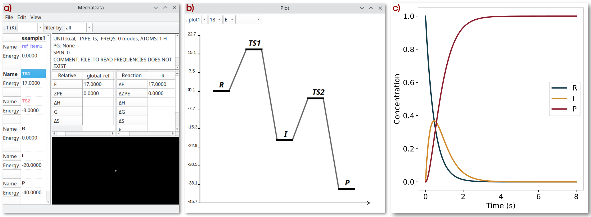
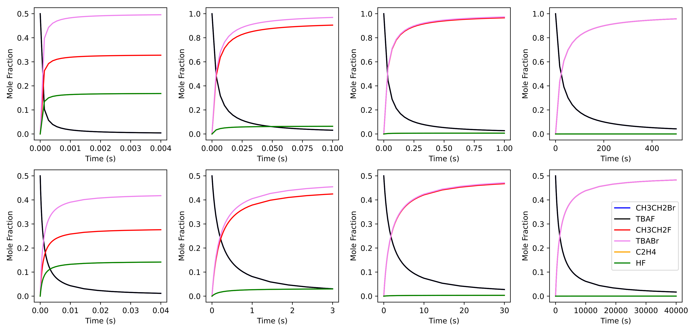

Getting Started
###############

If you have installed MechaSuite as a conda package, always activate the *ms* 
environment first::

  $ conda activate ms

Then, MechaData graphical user interface (GUI) can be open by::

  $ mechadata

Or by directly opening a reaction mechanism from JSON file::

  $ mechadata ${MS}/mechasuite/examples/example_2/fluorination.json

Here, *${MS}* denotes the path to the directory where MechaSuite is installed. 

Likewise, MechaData GUI can be open by typing the following command::

  $ mechaedit

Or by directly opening a geometry file (CIF, XYZ, POSCAR or OUTCAR)::

  $ mechaedit ${MS}/mechasuite/examples/example_2/SN2/SN2-TBAF.xyz

For MechaKin usage, indicate the JSON with the reaction mechanism::

  $ mechakinetics ${MS}/mechasuite/examples/example_1/rn.json

Example 1: Hypothetical sytem. First-order reaction 
**********************************************************

This example illustrates the general environment of Mechadata. To explore the example 
please enter corresponding directory::

$ cd examples/example_1
$ mechadata mechanism.json

The directory contains folders *R, I, P, TS1, TS2, ref_item1* representing hypthetical 
calculation directories. Examples 2 and 3 (below) ilustrate real calculations.

In this example, the hypothetical reaction is a simple two-step mechanism occurring in 
a batch reactor, where the concentration of reactants changes over time until reaching 
an equilibrium. The reaction network is defined as follows:

R ⇋ I

I ⇋ P

where *R*, *I* and *P* are the hypothetical reactant, intermediate and product, respectively. 
The rate constants for both steps are set to be equal by assigning identical forward Gibbs 
free energies of activation, such as 
ΔG\ :sup:`‡`\ :sub:`1,f`  =  ΔG\ :sup:`‡`\ :sub:`2,f` = 17 kcal/mol. 

Using Eyring's equation, the corresponding forward rate constants at 298 K are 
k\ :sub:`1,f` = k\ :sub:`2,f` = 2.17 s\ :sup:`-1`. 

To make the steps irreversible, the reverse constants are deliberately chosen to be small, 
k\ :sub:`1,r` = k\ :sub:`2,r` ∼ 10\ :sup:`-15` s\ :sup:`-1`. 

This can be achieved by setting the ΔG for the reverse steps 
considerably higher than the forward ones, like 
ΔG\ :sup:`‡`\ :sub:`1,r` = ΔG\ :sup:`‡`\ :sub:`2,r` = 57 kcal/mol.

**Figure 1a** illustrates the main interface of MechaData, displaying the central 
spreadsheet that lists the hypothetical minima species (*R*, *I*, and *P*) together 
with the corresponding transition states (*TS1* and *TS2*) and their associated 
hypothetical energies. Their relative energies with respect to the global reference 
(denoted as *global_ref*), along with the corresponding activation and reaction energies, 
are displayed in the smaller spreadsheets on the right (relative energy and reaction energy 
panels in \Cref{fig:Mechadata}b,c). In this example, the *global_ref* serves merely as an 
arbitrary zero-energy reference for illustration.

**Figure 1**. MechaData interface. **a)** Main spreadsheet with absolute and relative energies
for species R, I and P as well as for T S1 and T S2. **b)** Plotting tool for customizing graph
appearance prior to export. **c)** Time evolution of the concentration of R, I and P.

The interactive plotting interface displaying the corresponding energy profile derived from the 
reaction mechanism is shown in **Figure 1b**. The graphical elements representing minima and 
transition states, as well as their labels, can be customized in terms of style, color, line width, 
and position. Once the desired settings have been defined, a publication-ready version of the plot 
can be generated using Matplotlib (see the second example in the manuscript).

The concentration profiles in **Figure 1c** were obtained by numerically solving the system of 
differential equations using *mechakinetics*. The results illustrate that the concentration of 
*R* decreases over time, the intermediate *I* first increases and then declines after approximately 
0.1 seconds, and the product *P* increases exponentially, behavior characteristic of a first-order 
reaction with respect to *R*.

Beyond their illustrative role, this and many other hypothetical examples provide a valuable 
framework for educational purposes. By systematically varying kinetic and thermodynamic parameters, 
users can explore how individual elementary steps influence the overall behavior of a reaction network. 
Such interactive exploration facilitates an intuitive understanding of reaction kinetics, sensitivity to 
model parameters, and the interplay between mechanism and observable rates, making these examples 
particularly well suited for teaching and training in microkinetic modeling.

Example 2: Nucleophilic fluorination. Comparison with OpenMKM
***************************************************************
The second example illustrates competing reaction channels as studied by `Lisboa and Pliego Jr. <https://link.springer.com/article/10.1007/s00894-022-05160-5>`_, in which microsolvation effects on the selectivity between SN2 and E2 pathways were examined. The system involves nucleophilic fluorination of ethyl bromide by tetrabutylammonium fluoride (TBAF), with tert-butanol (TBOH) acting as an explicit microsolvating agent.
All necessary files and folders are found in examples directory::

$ cd examples/example_2
$ mechadata fluorination.json

Opening fluorination.json in MechaData displays a four-column spreadsheet, where each column corresponds to either the SN2 or E2 mechanism for systems containing between zero and three TBOH molecules.
Each row represents a specific intermediate or transition state, corresponding to optimized stationary points on the potential energy surface.

Within the interface, structure types are visually distinguished by color: reference species are highlighted in light purple, transition states in light red, and local minima in black. Selecting any entry provides its relative energy in the designated panel (spreadsheets on the right). For example, the SN2 transition state has a relative energy of 7.3 kcal/mol.
Reaction and activation energies can also be evaluated between any pair of intermediates sharing a consistent reference or atomic composition.
In this case, the activation barrier for the SN2 transition state relative to the REACTANT is likewise 7.3 kcal/mol, since the REACTANT is defined to have zero relative energy.
Further details on the energy referencing scheme are provided in Section  :ref:`Calculation of relative energies <relative-energy-section>`. 

Now, we compare the results of the fluorination reaction with the open source
microkinetics software OpenMKM . To that end, MechaSuite is very convenient because
it provides directly the activation energies and the pre-exponential factor requested by
OpenMKM. The input of OpenMKM are different, two files are required reactor.yaml and
thermo.yaml. The first contains general reactor and simulation settings, while the second
defines more concretely the reaction network. In the directory examples/example_2 in the
source code, there is a subfolder named “comparison openmkm” which contains the input
files created with the reaction network information calculated from the MechaData inter-
face. 
The example directory contains a python script “compare.py” to generate  :ref:`Figure 1 <figure-compare-openmkm>`.

.. _figure-compare-openmkm:

**Figure 1**: Comparison of the concentration profiles of microkinetics simulations with (fromleft to right) 0 to 4 TBOH molecules using MechaKinetics (top row) and OpenMKM (bottom row).

Because OpenMKM simulations and MechaKinetics use mean-field approximation, both
simulations can be compared directly. In addition, for OpenMKM we have assumed ideal
gas behavior and a batch model reactor, which is what MechaKinetics currently supports.
Other reactor models will be included in a future release. More information on OpenMKM
input structure can be found in the literature. 
Figure 1 shows the concentration profiles of the species involved in the fluorination
reaction using MechaKinetics (top) and OpenMKM (bottom).
Both software exhibit matching concentration evolutions and reach similar equilibrium
points, leading to equivalent results.

Example 3: Water formation on the Co(111) surface.
******************************************************

Example 3 describes the formation and desorption of a water molecule on the 111 surface of Co covered with O* adatoms.

The reaction was studied in the literature `R. Millán et al.: J. Catal. 364, 19 (2018) <https://www.sciencedirect.com/science/article/abs/pii/S002195171830188X>`_. 

This example illustrates the calculation of relative free energies of all species, the resulting free energy profiles (FEP) and microkinetics simulations at different temperatures.

For illustration purposes we will only consider one adsorption site, namely, the fcc site and will ignore the lateral interactions among O*, OH* and H*.
The rationale behind this choice is that H* species will be abundant because there is a continuous stream of H2 gas and its dissociation on the 111 Co surface is spontaneous (activation energies are less than 1 kcal/mol).
The reaction mechanism is the following:

H* + O* = OH*

OH* + H* = H2O*

H2O* = H2O (g) + *

To explore the example please enter corresponding directory::

$ cd examples/example_3

The directory contains density functional theory (DFT) calculations performed with VASP for a set of reference structures and reaction configurations. These include reference molecules (files named H2, O2, and the clean slab), adsorption minima (files named slab-O_fcc, slab-OH_fcc, slab-H₂O, and isolated H2O), and transition states (files named ts1 and ts2). We have specified “slab” for surface instead of the common “*” symbol because of the  meaning of * in linux regex. 

You can also find the file mecha.json with a mechanism (column) named “H2O” with all intermediates included, free energies calculated at 300, 400, 500, and 600 K, and the FEP created. Open the file with mechadata::

$ mechadata mecha.json

Click on the intermediates to see how the relative quantities are updated on the right panels (relative energy panel and reaction panel). In particular, right-click on ts1 and ts2, select frequencies-> show frequencies from the menu to verify that they contain only one imaginary frequency.

To visualize the FEPs just go to the menu: “view -> Show plot window” or just press “control+g”.

The first plot that appears is the electronic energy plot (option “E” is selected in the “plot type” combobox) but you can switch to the free energy profiles at different temperatures by selecting “G”. Furthermore, you can select the temperatures in the “Temperature” combobox. If you compare the profiles at 300 and 600 K, it is clear how the stability of the desorbed water molecule (last item in the FEP) increases (decrease of relative free energy with increase of temperature). 

The directory also contains two input files for MechaKinetics: rn_300.json and rn_600.json. They provide the input with rate constants at 300 K and 600 K respectively. If you run mechakinetics with these input file you will see interesting differences::

$ mechakinetics rn_300.json
$ mechakinetics rn_600.json

In the first case you will see that the system does not completely reach equilibrium after 10 s of simulation and the most abundant species is slab_OH. If you check again the FEP you will notice that slab_OH is the most stable species. In the second case (600 K) the system reaches equilibrium long before only 1 s of simulation reflecting the faster reaction rate. Moreover, the most abundant species is the gas water molecule which is in line with the fact that at 600K water is the most stable species in the FEP.

Now, the user is encouraged to recreate the contents of the mecha.json file by playing with the mecha.yaml input file which provides sections to read the calculator directories and create a mechanism. The specification of energy units, which plots are to be created, the classification of intermediates in reference, minima and transition state, etc. can be specified in the mecha.yaml input file which contains comments explaining these options.

Upon opening the input file mecha.yaml with mechadata::

$ mechadata mecha.yaml

we should see the following environment of mechadata containing the one column corresponding to the mechanism “H2O”:

As in the example_1 the free energy profile is automatically created because we specified the “plot” section in mecha.yaml and can be visualized by pressing control+g. Notice that now, there is no FEP with free energies, only with electronic energy because we have not calculated yet the free energies. To do so, we can go to the MechaData main window and select all items in the spreadsheet (or directly the whole “H2O” column), then right-click on any cell on the spreadsheet and select “thermochemical analysis -> calculate” from the popup menu. This will open a window allowing us to select the parameters to calculate the free energy for the selected intermediates. Type the following in the “300-600:100” in the “T(K)” energy. With this we will calculate the free energies at from 300 to 600 every 100 values of temperature. Now go to the FEPs and check if these temperatures become available in the “temperature” combobox after selecting “G” on the “plot type” combobox.

Exporting the reaction mechanism as an input json file can be achieved by right-clicking on the plotting window and selecting “Export Reaction Network”. This will allow creating an input file for mechakinetics to run microkinetics analysis. 

Preprocessing scripts
=====================
Importing individual calculations to an already created mechanism can be done by providing the corresponding calculation directory. 

However, some preprocessing is convenient to avoid errors in trying the determine the format of the output of such calculations. 

To that end, we provide sample scripts that create a file named *.data* inside each calculation directory containing information about how *mechadata* should read the files in the directory. 

Each line in the *.data* file represents a configuration entry, specified as a *tag: value* pair, interpreted as a `yaml <https://yaml.org/>`_ file. 

The following shows that the program of the QM calculation is VASP, where the file with the electronic energy is OSZICAR, or the energy can be manually set with *energy* option.
The file with the geometry is CONTCAR, and the calculated vibrational frequencies in OUTCAR file.
The unit for the energy is in eV, the total spin moment of the calculation is zero, this is an optimization calculation rather than a transition state, and that the point group is for a solid.

Other possible values are provided after the \# symbol::

  program:      vasp    # gaussian, orca
  energy_file:  OSZICAR # gaussian or orca output file name or even just numerical value
  energy:       -25.3   # define energy manually
  struct_file:  CONTCAR # any other xyz file
  freq_file:    OUTCAR  # output with vibrational frequency     
  unit:         eV      # kcal, kJ, Ha
  spin:         0       # 1, 2, etc
  tp:           min     # ts, ref
  pg:           solid   # C1, Cs, C2, C2v, C3v, C2h, Coov, D2h, D3h, D5h, Dooh, d3d, Td, Oh
