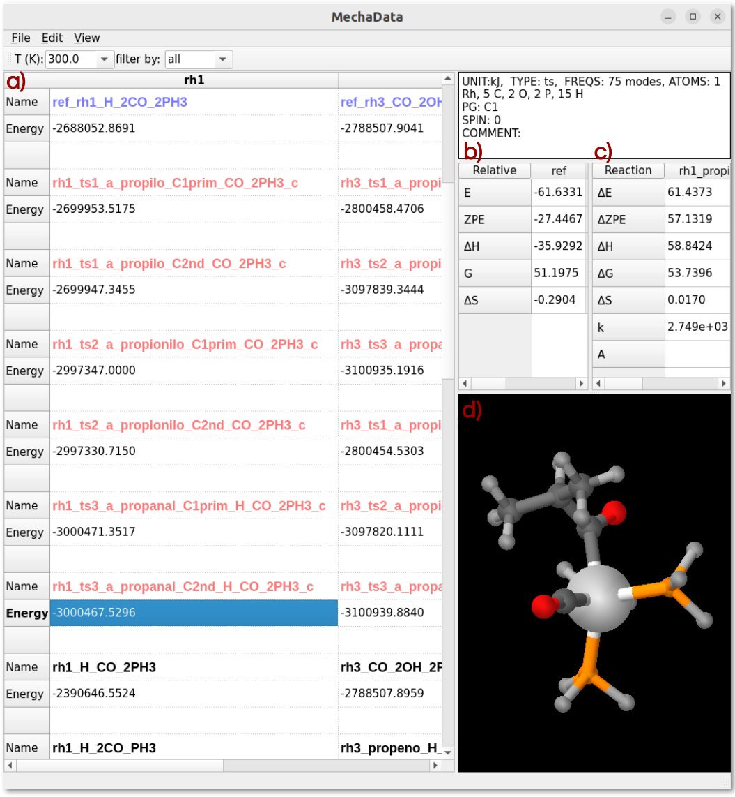
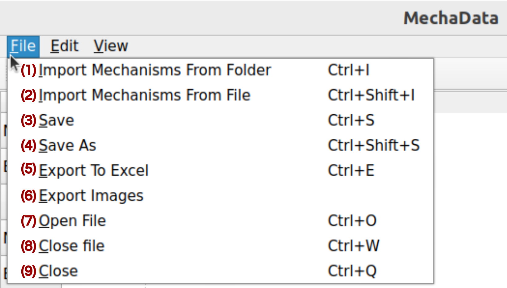
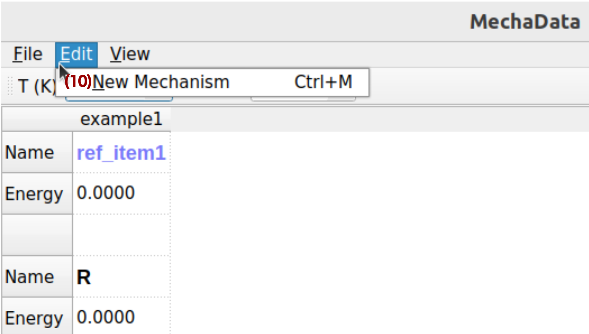
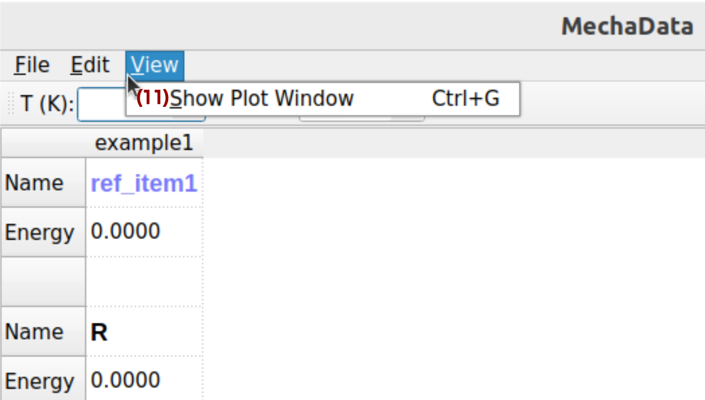
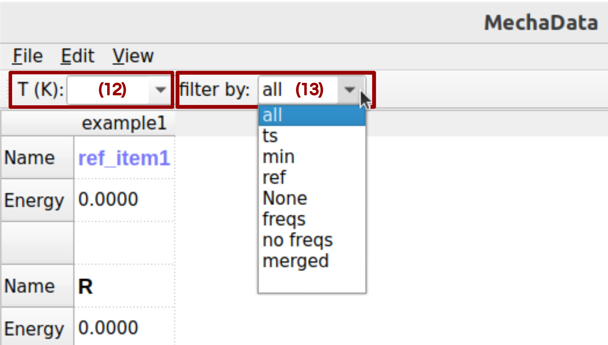
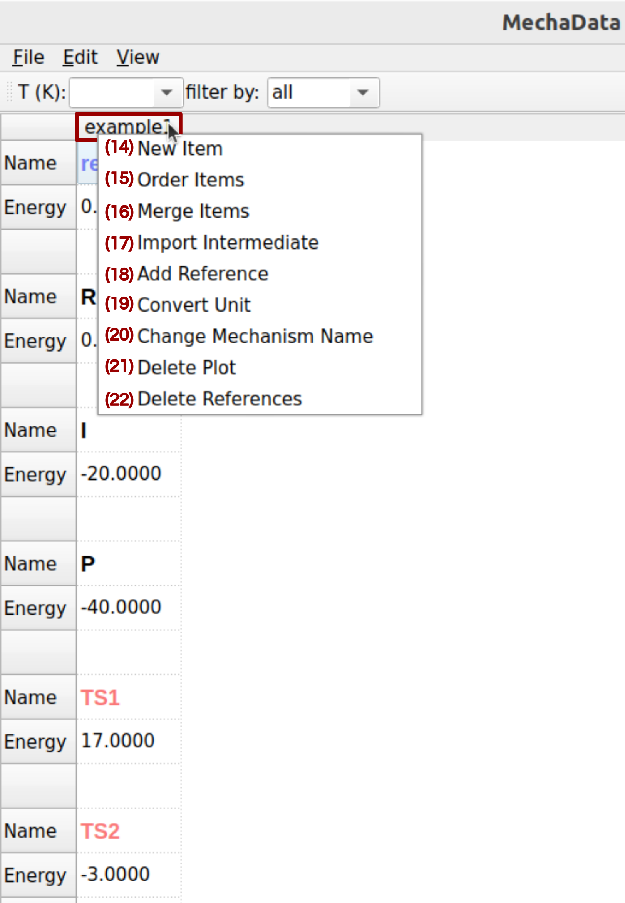
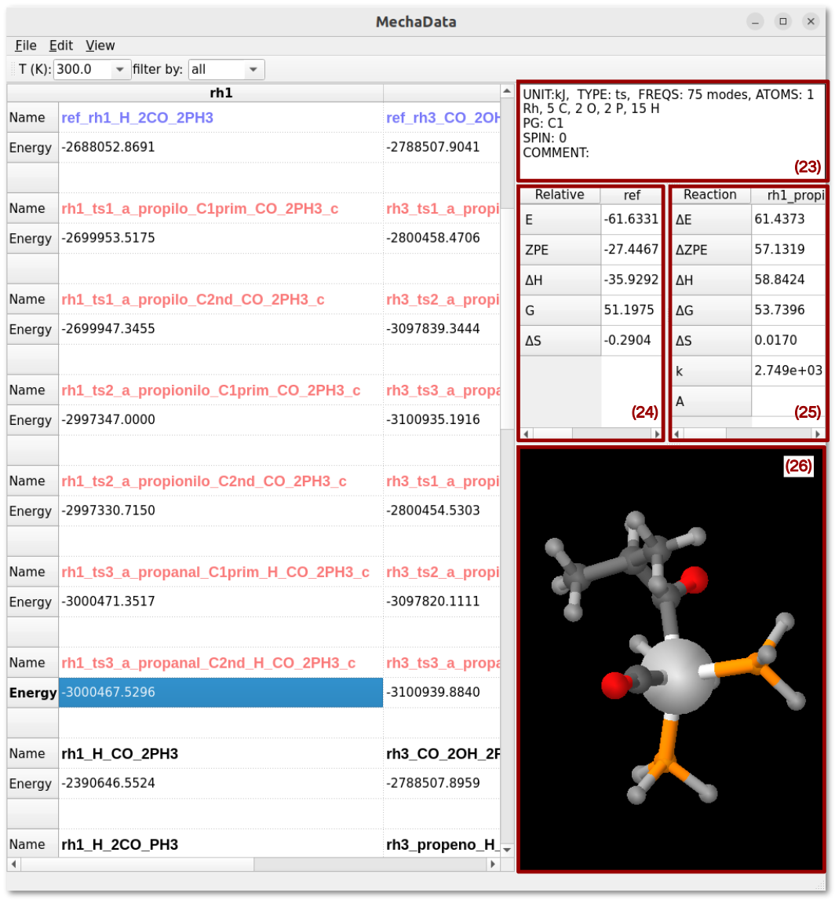
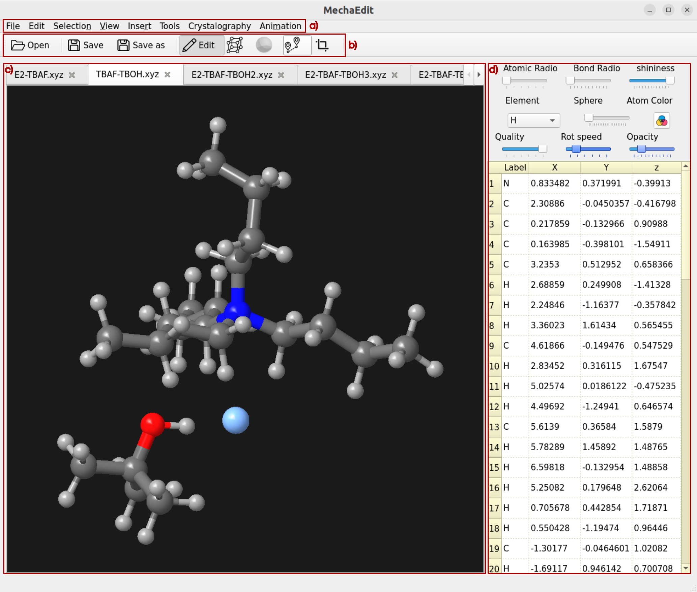
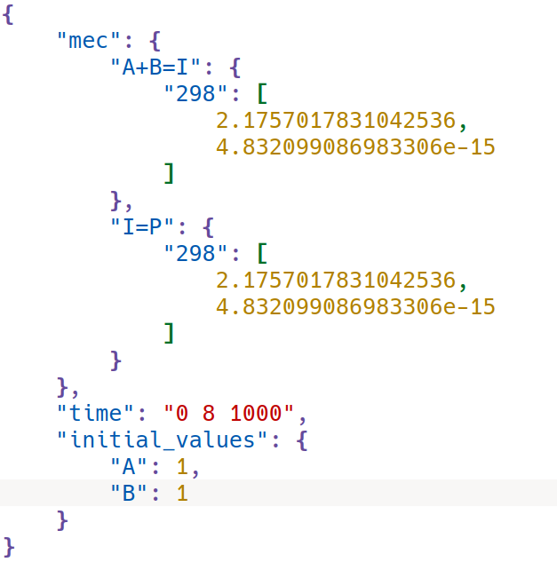

.. |dH| replace:: :math:`\Delta H`
.. |dS| replace:: :math:`\Delta S`
.. |dE| replace:: :math:`\Delta E`
.. |dG| replace:: :math:`\Delta G`
.. |dZPE| replace:: :math:`\Delta ZPE`

Modules
########

MechaData 
*****************

This structured interface enables users to manage complex quantum chemical data with clarity and 
flexibility, supporting advanced workflows for thermochemical analysis and kinetic modeling in a 
research context. The graphical user interface (GUI) is shown in **Figure 1**.

**Figure 1.** MechaData interface. **a)** Main spreadsheet for organizing reaction mechanisms. **b)** Relative 
energy panel and **c)** reaction energy panel. **d)** Embedded visualizer for molecular structures.

|

MechaData distinguishes itself through several design and functional advantages. Its key strengths include:

-- **Spreadsheet-like interface:** The column-based layout allows users to organize entire mechanisms, 
with each column representing a reaction mechanism (**Figure 1a**). This design offers a user-friendly 
interface that facilitates the analysis of reaction pathways, allowing users to focus their effort not 
on deciphering raw data, but on interpreting the underlying chemical processes and gaining meaningful 
mechanistic insight.

-- **Automatic reference energy calculations:** The reliable generation and comparison of reaction 
pathways depend on the precise calculation of relative energies based on appropriate reference species 
(**Figure 1b**), a procedure that is often laborious and susceptible to human error. One of MechaData’s 
most distinctive features is its ability to automatically compute relative energies for all intermediates, 
aligning them to user-defined reference states. This reduces manual effort and ensures consistency across 
large datasets. 

-- **Built-in thermochemical tools:** Vibrational frequency data can be scaled, edited, and directly used 
to calculate entropies, enthalpies, and Gibbs free energies. The platform seamlessly supports 
post-processing of this data, its visualization via integrated plotting tools, and its application in 
microkinetic modeling, enabling users to transition effortlessly from thermochemical calculations to 
kinetic analysis.

-- **Integrated visualization:** As another unique feature of MechaData, molecular struc-tures can be 
visualized directly within the interface (**Figure 1d**) or in the advanced MechaEdit module. This 
functionality enables users to easily inspect the system states at each step of the reaction pathway 
without the need to manage multiple geometry files or relying on external visualization packages. Such 
accessibility provides an intuitive, researcher-oriented experience that prioritizes the mechanistic 
understanding over manual file handling.

-- **No programming required:** Unlike many comparable tools, MechaData provides a fully featured 
graphical user interface (GUI, **Figure 1a-d**), requiring no coding knowledge and making the platform 
accessible to a broader community of chemists, including experimentalists seeking mechanistic insights. 
At the same time, users who prefer to work programmatically can export the mechanisms in JSON, allowing 
further customization or integration into computational workflows. Also, the post-processed data can be 
easily exported in structured formats (csv and xlsx files), facilitating reproducibility, data sharing 
and further analysis.

-- **Direct plotting of free energy profiles:** A key innovation of MechaData is its ability to generate 
free energy diagrams directly from the organized data, without the need for external plotting tools. 
This enables both reproducibility and customization as the diagrams can be visualized and readily adjusted 
(including style, formatting, labels and layout) before being exported as high-quality images using the 
Matplotlib python library.

|

User interface and functionality
====================================

The GUI of MechaData is designed to facilitate the setup, execution, and analysis of reaction network 
simulations through an intuitive, user-centric layout. It combines spreadsheet-style controls with 
interactive visual tools, while the menu structure is organized into logical categories for data management, 
visualization, plotting, and mechanistic editing. This section provides an overview of the main components 
of the GUI and describes the functionality of the available menus.

|

File Menu
----------

All the options available in MechaData file menu are shown in **Figure 2**, and main functionalities are described below.

**Figure 2**. File menu in MechaData GUI.

|

**(1) Import Mechanism From Folder:** Loads a reaction mechanism from a directory containing several 
folders (one per calculation) with quantum chemical output files. MechaSuite automatically extracts 
relevant thermochemical and structural data for each intermediate and transition state. It is advisable 
to run the preprocessing scripts first, to ensure the QM software and filenames are set properly. 

**(2) Import Mechanism From File:** Loads a reaction mechanism from a JSON file to the selected 
mechanism (column).

**(3/4) Save / Save As:** Saves the current workspace as a JSON file, including all mechanisms, 
structures, references, and calculated data. Useful for preserving project state.

**(5) Export to Excel:** Exports the reaction data sheet to an Excel file for external analysis 
or reporting.

**(7-9) Open / Close:** Opens an existing mechanism project or closes the current workspace.

|

Edit Menu
---------

MechaData edit menu is shown in **Figure 3**, with corresponding description below.

**Figure 3**. Edit menu in MechaData GUI.

|

**(10) New Mechanism:** Creates a new reaction mechanism column within the workspace. Each column 
represents an independent mechanism and serves as a container for intermediates, transition states, 
and references.

|

View Menu 
---------

MechaData view menu is shown in **Figure 4**, with corresponding description below.

**Figure 4**. Edit menu in MechaData GUI.

|

**(11) Plot:** Generates plots of energy profiles or kinetic trends based on the currently selected 
mechanism and data. Users can visualize free energy diagrams, reaction coordinates, or custom 
thermodynamic plots.

|

Data filters 
--------------

Results imported in MechaData can be filtered by different criteria, as illustrated in  **Figure 5**.

**Figure 5**. Data filters in MechaData GUI.

|

**(12) Set temperature:** Sets the temperature of the values shown in the relative energy panel (**Figure 1c**) and reaction panel (**Figure 1d**).

**(13) Filter by:** Filter the items shown in the spreadsheet.

|

Right-Click Options on Columns (Mechanism-Level Controls)
------------------------------------------------------------

Several options are shown when right-clicking on a given column (options 14--22 in **Figure 6**).

**Figure 6**. Right-click options on columns in MechaData GUI.

|

**(14) New Item:** Adds a new row to the current mechanism for a structure, intermediate, or 
transition state.
  
**(15) Order Items:** Change the order of the items in a column.

**(16) Merge Items:** Merges intermediates to simplify the mechanism representation. 
 
**(17) Import Intermediate:** Adds new species to the mechanism by importing them from external 
quantum chemical output.

**(18) Add Reference:** Adds a new energy reference by combining several reference items.

**(19) Convert Units:** Converts energy units (e.g., Hartree to kJ/mol) across the mechanism 
for consistency.

**(20) Change Mechanism Name:** Renames the mechanism column.

**(21/22) Delete Plot / Delete References:** Removes specific plots or reference entries from 
the mechanism.

|

Right side panels
------------------------

The right side of MechaData interface presents several panels with important information about 
the system and relative energy values (**Figure 7**).

**Figure 7**. Right-click options on rows in MechaData GUI.

|

**(23) System Information:** summarizes important information about the selected item, such as 
the energy unit, type of calculation, number of vibrational frequencies, number of atoms,
symmetry and total spin moment set for the calculation, as well as a comment set by the user.

**(24) Relative Energy Panel:** Display the calculated relative quantities, such the energy (E), 
zero point energy (ZPE), enthalpy (|dH|), Gibbs free energy (|dG|) and entropy (|dS|), for 
the selected item at a given temperature. 

**(25) Reaction Panel:** Display calculated quantities for a given reaction, such as the reaction 
energy (|dE|), ZPE-corrected reaction energy (|dZPE|), reaction enthalpy (|dH|), 
reaction Gibbs free energy (|dG|), reaction entropy  (|dS|), reaction rate constant (k) and 
pre-exponential factor (A) from TST theory.

.. (see the theoretical background for further details).

**(26) Structure Vizualizer:** Integrated geometry visualization for efficient inspection and 
validation of computed structures.

|

Right-Click Options on Row Entries (Species-Level Controls)
--------------------------------------------------------------

Several options are shown when right-clicking on a given row (**Figures 8--10**).

.. figure:: fig08.png

**Figure 8**. Right-click options on rows in MechaData GUI.

|

**(27-30) Frequencies:** Opens a panel to load, view, scale, or edit vibrational frequencies 
from quantum chemical calculations.

|

.. figure:: fig09.png

**Figure 9**. Right-click options on rows in MechaData GUI (continuation).

|

**(31-33) Thermochemical Analysis:** Computes thermodynamic parameters (G, H, S) based on 
vibrational and structural data.

|

.. figure:: fig10.png

**Figure 10**. Right-click options on rows in MechaData GUI (continuation).

|

**(34-36) Plot:** Generates energy profiles or add selected intermediates to existing free energy 
profiles.

**(37/38) Add Reference / Add Reactant:** Designates the selected species as a reference or adds 
it as a reactant to the mechanism.

**(39) Set Type (Minimum, Transition State, Reference):** Categorizes the species for use in kinetics 
and visualization.

**(40) Set Point Group:** Assigns a symmetry point group, which may be used in entropy corrections.

**(41) Set Spin Multiplicity:** Assigns spin multiplicity for electronic entropy.

**(42) Edit Comment:** Adds or modifies user annotations for the species.

**(43) Invert Selection:** Toggles current selections. Useful for batch operations.

**(44) Load Structure:** Imports molecular geometry data from a file.

**(45) Copy to Mechanism (Column):** Duplicates the selected species into another column.

**(46) Duplicate Item:** Creates a copy of the current entry.

**(47) Merge Items:** Create a new intermediate by grouping individual intermediates or transition 
states. The effect would be to sum up individual energies.

**(48) Update Item:** Updates the calculation results, energy, geometry, vibrational frequencies, 
etc., from the calculation folder. The calculation folder must have the same name as the intermediate, 
and be located in the same working directory.

**(49) Update Item From Folder:** Updates the calculation results, energy, geometry, vibrational 
frequencies, etc., from the specified folder.

**(50) Update Selection From Folder:** Updates the calculation results, energy, geometry, vibrational 
frequencies, etc., from the specified folder. The folder must contain subfolders matching the names of 
the selected items.
 
**(52) Export Thermochemical CSV:** Saves thermodynamic data for the selected species to a CSV file.

**(53) Remove 1/3 of Translation Entropy:** Applies a correction often used for adsorbed species in 
surface chemistry (see `C. Rzepa et al.: J. Phys. Chem. C 124, 16350 (2020) <https://doi.org/10.1021/acs.jpcc.0c02671>`_)

**(56) Import Structure Visual State:** Modifies, for the selected items, the rotation matrix used to 
show the geometry in the embedded visualizer.

**(57) Show Structure in MechaEdit:** Opens the species in MechaEdit, the advanced structure editor, 
for detailed modification or inspection.

|

MechaEdit
********************
Although the basic geometry visualization capabilities are integrated into MechaData, MechaEdit is 
specifically designed for detailed structural analysis and editing. In addition to the menu bar 
(**Figure 11a**), the GUI is composed of a toolbar (**Figure 11b**), the main drawing canvas 
(**Figure 11c**), and a side panel (**Figure 11d**). The most relevant options are described below.

|

**Figure 11**. Overview MechaEdit GUI.

|

Toolbar
========

The following description corresponds to the functionality of the buttons in the Toolbar panel 
(**Figure 11b**).

-- **Open:** opens a new geometry file.

-- **Save:** saves the visualized geometry to the currently opened file with the same name.

-- **Save as:** saves the visualized geometry to a different file.

-- **Edit:** activates the edit mode, in which atoms that are selected can be dragged (while moving 
the cursor with the mouse left button clicked) or rotated (while moving the cursor with the mouse 
right button clicked).

-- **Lattice:** toggles the visualization of the unit cell on or off.

-- **Specular:** toggles on and off the specular effect on the drawn objects (spheres, cylinders, 
etc.).

-- **Track:** enables track mode for the currently selected atoms. After selecting two atoms 
sequentially, their interatomic distance is tracked by activating this option. When three atoms 
are selected sequentially, the distances (in selection order) and the angle are tracked. When four 
atoms are selected sequentially, the distances (in selection order), angles, and the torsion angle 
are tracked. After the track mode is enabled, the selection can be modified and any change made with 
the edit mode is continuously tracked, and their values (distances, angles, and torsion angles) are 
updated in the bottom bar of MechaEdit window.

-- **Crop:** activates the crop mode, in which a rectangular region of the drawing canvas can be 
defined before image rendering and export. It is useful for controlling the size and which part of 
the structure will be included in the saved image.

|

Drawing canvas
================

In the drawing canvas (**Figure 11c**), the structure can be rotated by holding the left mouse 
button and moving the mouse. The view can be translated by holding the right mouse button and 
moving the mouse. Individual atoms can be selected using Ctrl + left click, while a range of 
atoms can be selected by holding Ctrl and dragging with the left mouse button. Selected atoms 
can be deleted using the Delete key. Selected atoms can be hidden with Ctrl + H shortcut.

|

Side panel
============

The side panel (**Figure 11d**) contains a set of slide bars and buttons designed to intuitively 
modify the properties of the canvas elements (atomic properties, visual properties and canvas 
behavior). Besides, the included coordinates editor allows selecting and modifying the atomic 
coordinates individually. In addition, a frequency and frames listbox can be added to the side 
panel. The frequency listbox can be enabled/disabled from the tool menu. The frames listbox is 
automatically enabled if the opened file is a trajectory.

|

Menu Options
==============

File Menu
-------------

The File menu contains options for loading, saving, and exporting chemical structures.

-- **New:** creates a new, empty structure.

-- **Open:** loads a structure file into the visualization canvas.

-- **Save:** saves the current structure to the active file.

-- **Save As:** saves the current structure to a new file location.

-- **Render (POV-Ray):** exports the current structure for high-quality rendering using 
`POV-Ray <https://www.povray.org/>`_, suitable for publication-quality images.

-- **Close:** closes the program.

|

Edit Menu
-----------

The Edit menu provides basic editing operations for selected atoms.

-- **Copy:** copies the currently selected atoms to the clipboard.

-- **Paste:**  inserts previously copied atoms into the structure.

-- **Center:** centers the structure in the drawing canvas.

|

Selection Menu
----------------

The Selection menu provides tools to create and modify atom selections.

-- **Select all:** selects all atoms in the current structure.

-- **Invert selection:** reverses the current selection state.

-- **Select by bonds:** expands the selection based on bonding connectivity.

-- **Select inside sphere:** selects all atoms inside a given radius from a previously 
selected atom.

-- **Select groups:** selects previously created groups (in tools menu).

|

View Menu
-----------

The View menu controls the representation of the structure.

-- **Restore defaults:** changes the sphere and cylinder radii, and colors to the 
predefined values.

-- **Models:** allows changing to a licorice or wire representation.

-- **Atom:** allow changing atomic properties and representation.

-- **Background color:** changes the background color of the canvas.

-- **Styles:** allows changing predefined styles from files.

-- **Set zoom:** allows defining a zoom ratio with respect to the default zoom to 
control how far the structure is visualized.

|

Insert Menu
---------------

The Insert menu allows the insertion of structures in the current representation.

-- **Fragment:** inserts a structure from a file into the current visualization.

-- **Download IZA:** downloads a zeolite CIF file from the 
`IZA website <https://europe.iza-structure.org/IZA-SC/ftc_table.php>`_.

|

Tools Menu
---------------

The Tools menu provides interactive analysis and measurement features.

-- **Fix Selected:** sets a fixed flag internally to *true* so that the saved 
structure in VASP (POSCAR) format contains the selective dynamics flags.

-- **Unfix Selected:** sets a fixed flag internally to *false* so that the saved 
structure in VASP (POSCAR) format contains the selective dynamics flags.

-- **Translate:** allows translating the selected atoms by adding an input vector, 
or to specified x, y, or z positions.

-- **Rotate:** rotates the whole structure around the z axis or bonds (by preselecting 
the two atoms of the bond).

-- **Repeat:** replicates the unit cell along the x, y and/or z direction by the 
specified amount. There must be a unit cell defined in the structure.

-- **Coordinates:** shows or hides the coordinates listbox in the side panel.

-- **Create group:** with this option, atoms can be grouped for future selection 
and manipulations.

|

Crystallography
-------------------

-- **Set Unit Cell:** opens a dialog to define or modify unit cell parameters.

|

Animation Menu
-----------------

The Animation menu allows playback of dynamic structural data.

-- **Play:** plays an available animation or trajectory.

-- **Play Frequencies:** animates vibrational modes, typically obtained from 
frequency calculations.

-- **Time Delay:** adjusts the delay between animation frames to control playback speed.

|

Notes
-----------

Most menu actions operate on the currently selected atoms. Atom selection is performed 
directly in the drawing canvas using mouse and keyboard controls. Available visualization, 
animation, and analysis features depend on the data present in the loaded structure.

|

MechaKinetics 
***********************

The MechaKinetics module accepts input data in JSON format, which defines the chemical 
reactions, temperature-dependent rate data, simulation time parameters, and initial 
species concentrations. The input file can be generated in the MechaData plotting 
interface (right-click and *export reaction network*) and customized as needed.  

|

**Figure 12**. Input structure of JSON input file for MechaKinetics.

|

As shown in **Figure 12**, it has the following sections:

-- **Reaction Data:** The *"mec"* field contains the chemical reactions and their 
kinetic parameters. Each key corresponds to a reaction, that is written in the general 
format  *"aA+bB=cC+dD"*.  Within each reaction, the rates are provided as a dictionary 
of temperatures (in Kelvin) and a list containing two numbers, e.g: *"298": [2.17, 4.83e-15]*. 
The first number is the forward reaction rate and the second the reverse reaction rate 
(both in 1/s}), calculated using Eyring's equation. Multiple temperatures can be included 
if the reaction rate needs to be evaluated across a temperature range.

-- **Simulation Time:** The *"time"* field defines the time span (in seconds) for the kinetics 
simulation as a string of three values: *"time": "t\_start t\_end t\_step"*.

-- **Initial Values:** The *"initial_values"* field defines the starting concentrations of 
reacting species, for example, *"initial_values": \{   "A": 1, "B": 1   \}*.

Here, A and B start with a concentration of 1 (in arbitrary units consistent across all 
species). All other species are assumed to start at zero unless explicitly specified.

The user is encouraged to see other examples of these input files in the `examples 
<https://github.com/rm-compchem/mechasuite/tree/main/examples>`_ folder of the source 
code, such as *rn.json* and *reaction\_network\_0tboh.json*.

