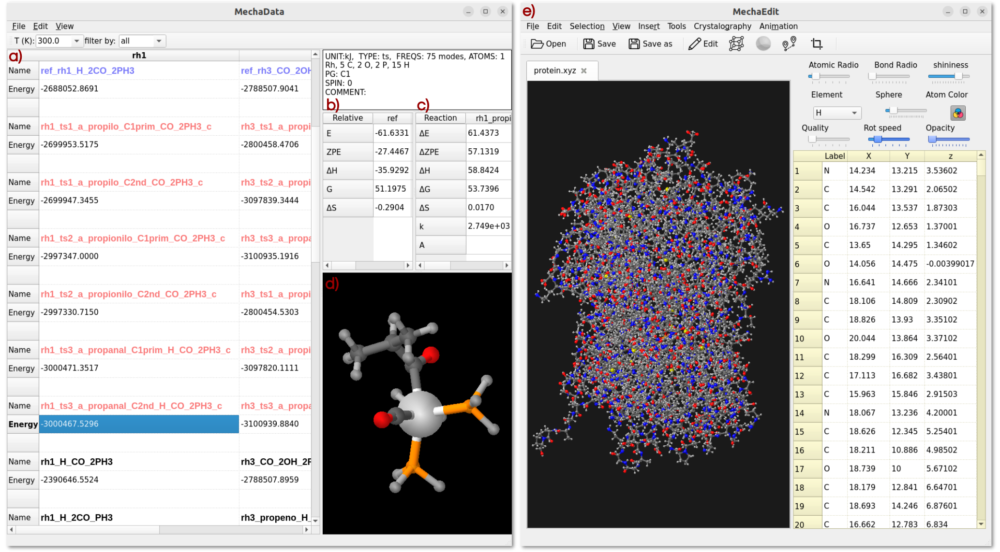
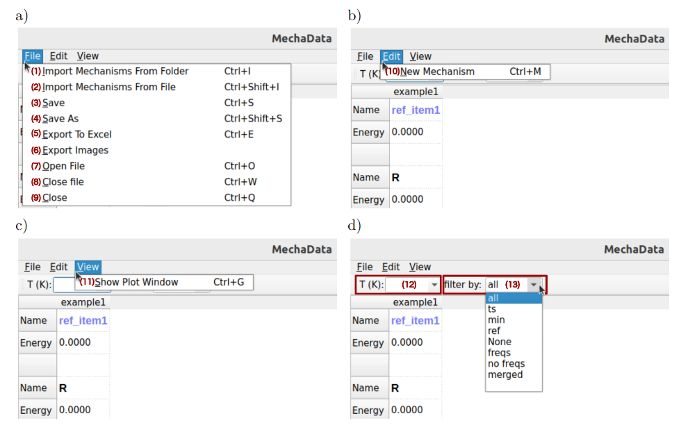

Usage
#####

Using MechaSuite modules
========================
If you have installed MechaSuite as a conda package, always activate the _ms_ environment first::

  $ conda activate ms

Then, MechaData graphical user interface (GUI) can be open by::

  $ mechadata.py
  # or opening directly a reaction mechanism from JSON file
  $ mechadata.py ${MS}/mechasuite/examples/example_2/fluorination.json

Here, _${MS}_ denotes the path to the directory where \mechasuite is installed. 
Likewise, MechaData GUI can be open by typing the following command::

  $ mechaedit
  # or opening directly a geometry file (CIF, XYZ, POSCAR or OUTCAR)
  $ mechaedit ${MS}/mechasuite/examples/example_2/SN2/SN2-TBAF.xyz

For MechaKin usage, indicate the JSON with the reaction mechanism::

  $ mechakinetics.py ${MS}/mechasuite/examples/example_1/rn.json

Preprocessing scripts
=====================

Importing individual calculations to an already created mechanism can be done by providing the corresponding calculation directory. However, some preprocessing is convenient to avoid errors in trying the determine the format of the output of such calculations. To that end, we provide sample scripts that create a file named *data* inside each calculation directory containing information about how *mechadata.py* should read the files in the directory. Each line in the *.data* file represents a configuration entry, specified as a *tag value* pair. The following shows that the program of the QM calculation is VASP, the file with the electronic energy is OSZICAR, unit for the energy is in eV, the multiplicity of the calculation is singlet, the file with the geometry is CONTCAR, and that this is an optimization calculation rather than a transition state.  Other possible values are provided after the \# symbol::

  program vasp    # gaussian, orca
  energy  OSZICAR # gaussian or orca output file name or even just numerical value
  struct  POSCAR  # any other xyz file
  unit    eV      # kcal, kJ, Ha
  spin    0       # 1, 2, etc
  tp      min     # ts, ref
  pg      solid   # C1, Cs, C2, C2v, C3v, C2h, Coov, D2h, D3h, D5h, Dooh, d3d, Td, Oh

MechaData module
================

MechaData distinguishes itself through several design and functional advantages. Its key strengths include:
 * Spreadsheet-like interface: The column-based layout allows users to organize entire mechanisms, with each column representing a reaction mechanism (Figure S2a). This design offers a user-friendly interface that facilitates the analysis of reaction pathways, allowing users to focus their effort not on deciphering raw data, but on interpreting the underlying chemical processes and gaining meaningful mechanistic insight.

 * Automatic reference energy calculations: The reliable generation and comparison of reaction pathways depend on the precise calculation of relative energies based on appropriate reference species (Figure S2b), a procedure that is often laborious and susceptible to human error. One of MechaData’s most distinctive features is its ability to automatically compute relative energies for all intermediates, aligning them to user-defined reference states. This reduces manual effort and ensures consistency across large datasets. 

 * Built-in thermochemical tools: Vibrational frequency data can be scaled, edited, and directly used to calculate entropies, enthalpies, and Gibbs free energies. The platform seamlessly supports post-processing of this data, its visualization via integrated plotting tools, and its application in microkinetic modeling, enabling users to transition effortlessly from thermochemical calculations to kinetic analysis.
    
 * Integrated visualization: As another unique feature of MechaData, molecular struc-tures can be visualized directly within the interface (Figure S2d) or in the advanced MechaEdit module. This functionality enables users to easily inspect the system states at each step of the reaction pathway without the need to manage multiple geometry files or relying on external visualization packages. Such accessibility provides an intuitive, researcher-oriented experience that prioritizes the mechanistic understanding over manual file handling.

 * No programming required: Unlike many comparable tools, MechaData provides a fully featured graphical user interface (GUI, Figure S2a-d), requiring no coding knowledge and making the platform accessible to a broader community of chemists, including experimentalists seeking mechanistic insights. At the same time, users who prefer to work programmatically can export the mechanisms in JSON, allowing further customization or integration into computational workflows. Also, the post-processed data can be easily exported in structured formats (csv and xlsx files), facilitating reproducibility, data sharing and further analysis.

 * Direct plotting of free energy profiles: A key innovation of MechaData is its ability to generate free energy diagrams directly from the organized data, without the need for external plotting tools. This enables both reproducibility and customization as the diagrams can be visualized and readily adjusted (including style, formatting, labels and layout) before being exported as high-quality images using the Matplotlib python library.

   Figure 2. MechaData interface. a) Main spreadsheet for organizing reaction mechanisms. b) Relative energy panel and c) reaction energy panel. d) Embedded visualizer for molecular structures. e) MechaEdit interface.

User interface and functionality
---------------------------------

The GUI of *mechadata* is designed to facilitate the setup, execution, and analysis of reaction network simulations through an intuitive, user-centric layout. It combines spreadsheet-style controls with interactive visual tools, while the menu structure is organized into logical categories for data management, visualization, plotting, and mechanistic editing. This section provides an overview of the main components of the GUI and describes the functionality of the available menus.

File Menu
-----------------------------------

  * (1) **Import Mechanism From Folder:** Loads a reaction mechanism from a directory containing several folders (one per calculation) with quantum chemical output files. *mechasuite* automatically extracts relevant thermochemical and structural data for each intermediate and transition state. It is advisable to run the preprocessing scripts first, to ensure the QM software and filenames are set properly. 

  * (2) **Import Mechanism From File:** Loads a reaction mechanism from a JSON file to the selected mechanism (column).
  
  * (3/4) **Save / Save As:** Saves the current workspace as a JSON file, including all mechanisms, structures, references, and calculated data. Useful for preserving project state.

  * (5) **Export to Excel:** Exports the reaction data sheet to an Excel file for external analysis or reporting.

  * (7-9) **Open / Close:** Opens an existing mechanism project or closes the current workspace.

  Figure 3. Overview of *mechadata* GUI showing the available menus a–c) and the filtering options d), which allow to filter the calculations by temperature and type. 
